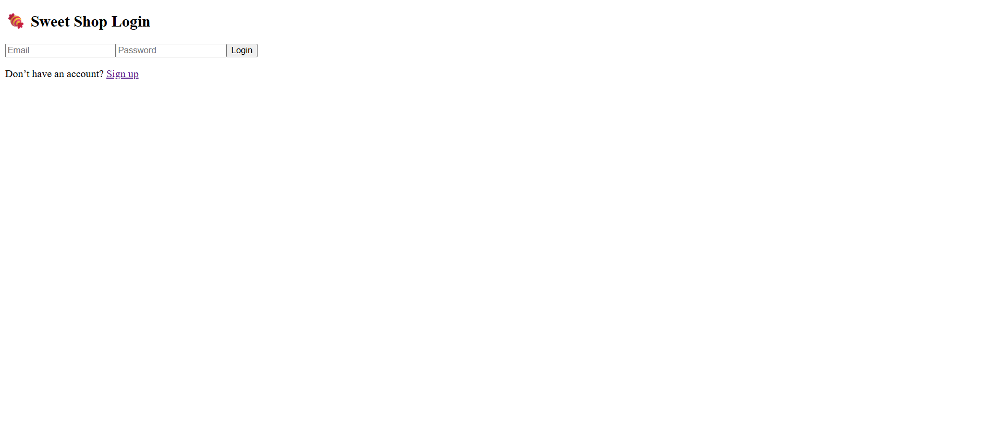
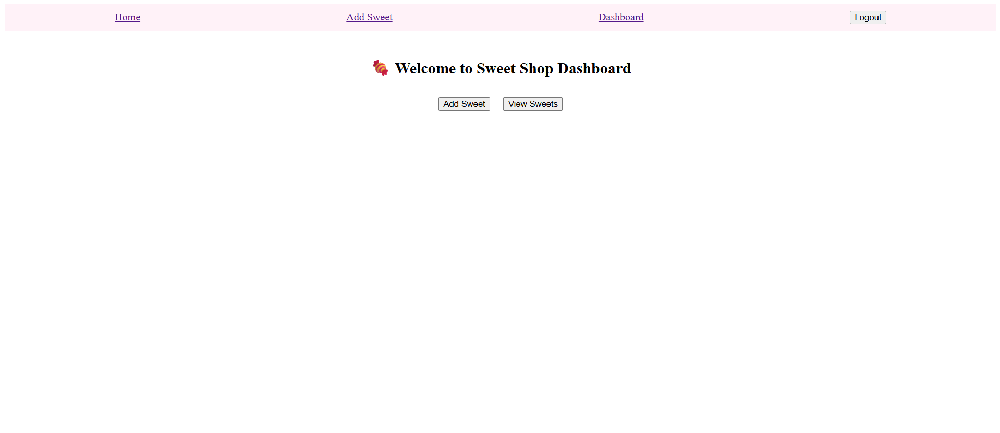
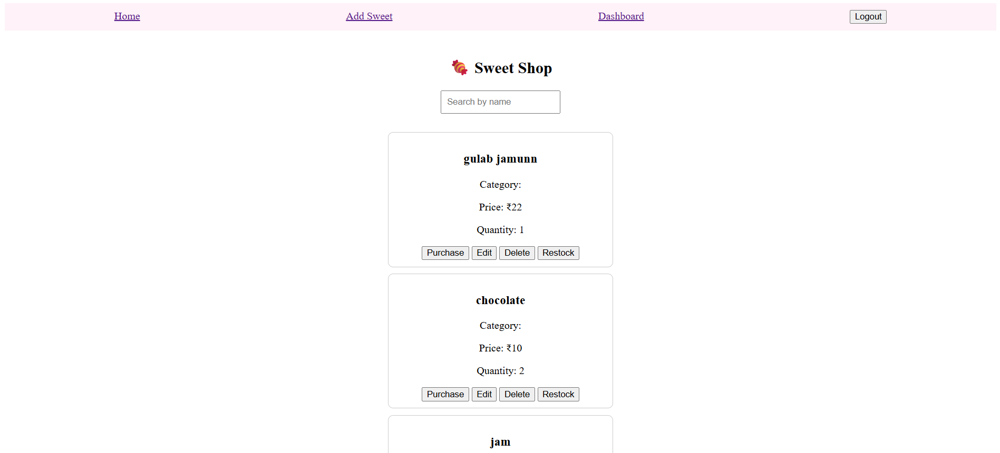

#Sweet Shop Management System
##A full-stack app to manage sweets inventory, track stock, and handle authentication for admin users.

# Backend
cd server
npm install
npm start

# Frontend
cd client
npm install
npm start

## My AI Usage
I used ChatGPT to:
- Debug backend routes and test failures
- Write unit tests for auth and sweets modules
- Improve UI with CSS and responsive layout
- Get a clean README template

AI helped me save time and understand clean code structure while I made manual edits to ensure correctness.

## Screenshots

### Login Page

### SignUp Page

### Dashboard Page

### View Sweets Page

